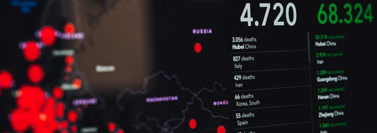

<h1 align="center">
  Virus spread simulation
</h1>

<p align="center">
  <a href="https://www.python.org/">
    
  </a>
  <a href="https://opensource.org/licenses/MIT">
    
  </a>
  <a href="https://www.linkedin.com/in/teiva-s/">
    
  </a>
</p>


 <p align="center">
    Simple visualization of how fast a virus can spread among population.
    <br />
  </p>

<!-- TABLE OF CONTENTS -->
## Table of Contents

* [About the Project](#about-the-project)
* [Getting Started](#getting-started)
* [Usage](#usage)
* [Contact](#contact)

<!-- ABOUT THE PROJECT -->
## About The Project

<p align="center">
  <a href="https://github.com/smtr42">
    
  </a>
</p>

During the Covid-19 outbreak I saw a very nice article from the [Washington Post](https://www.washingtonpost.com/graphics/2020/world/corona-simulator/) explaining how a virus spread among people. It contained nice embedded visuals.
I wanted, as a personal challenge and as an aspiring programmer, to write a similar program but in python 3.

It was heavily inspired from [Peter Collingridge](https://github.com/petercollingridge) physics simulation and his very nice [tutorial](http://www.petercollingridge.co.uk/tutorials/pygame-physics-simulation/).


<!-- GETTING STARTED -->
## Getting Started

### Installation
I used Python 3.7.
I use pipenv to manage dependencies.

1. Clone the repo
```sh
git clone https://github.com/smtr42/spread.git
```
2. Install required dependencies
```sh
pipenv install
```
### Launch simulation


<!-- USAGE EXAMPLES -->
## Usage
Open a Command Line Interface and launch the main.py script with Python.
```shell script
python -m main
```
### Specifications


## Authors
Project Link: [https://github.com/smtr42/P5_openfoodfact]

* **Simonnet T** - *Initial work* - [smtr42](https://github.com/smtr42)
   
  <a href="https://www.linkedin.com/in/teiva-s/">
   
 </a>
<br>

Inspired from [Peter Collingridge](https://github.com/petercollingridge) physics simulation and his very nice [tutorial](http://www.petercollingridge.co.uk/tutorials/pygame-physics-simulation/).

Photo by [Markus Spiske](https://unsplash.com/@markusspiske?utm_source=unsplash&utm_medium=referral&utm_content=creditCopyText) on [Unsplash](https://unsplash.com/?utm_source=unsplash&utm_medium=referral&utm_content=creditCopyText)