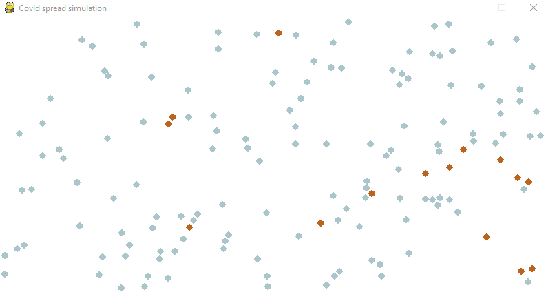

<h1 align="center">
  Virus spread simulation
</h1>

<p align="center">
  <a href="https://www.python.org/">
    
  </a>
  <a href="https://opensource.org/licenses/MIT">
    
  </a>
  <a href="https://www.linkedin.com/in/teiva-s/">
    
  </a>
</p>


 <p align="center">
    Simple visualization of how fast a virus can spread among population.
    <br />
  </p>

<!-- TABLE OF CONTENTS -->
## Table of Contents

* [About the Project](#about-the-project)
* [Getting Started](#getting-started)
* [Usage](#usage)
* [Contact](#authors)

<!-- ABOUT THE PROJECT -->
## About The Project

<p align="center">
  <a href="https://github.com/smtr42">
    
  </a>
</p>

During the Covid-19 outbreak I saw a very nice article from the [Washington Post](https://www.washingtonpost.com/graphics/2020/world/corona-simulator/) explaining how a virus spread among people. It includes nice embedded visuals made by [Harry Stevens](https://twitter.com/Harry_Stevens).
I wanted, as a personal challenge and as an aspiring programmer, to write a similar simple program but in python 3.

The collision algorithm was heavily inspired (copied) from [Peter Collingridge](https://github.com/petercollingridge) python 2 physics simulation and his very nice [tutorial](http://www.petercollingridge.co.uk/tutorials/pygame-physics-simulation/).
### State
It's a simple simulation. There is yet no chart implementation.

The algorithm is quite expensive, so above a few hundred particles the simulation is not usable.

It's a quick side project, optimisation, PEP compliance, documentation and general code readability will be worked in the future.
### Example
<p align="center">
  <a href="https://github.com/smtr42">
    
  </a>
</p>

<!-- GETTING STARTED -->
## Getting Started

### Installation
I used Python 3.7.
I use pipenv to manage dependencies.

#### Pipenv
- Clone the repo
```shell script
git clone https://github.com/smtr42/spread.git
```
- Install required dependencies
```shell script
pipenv install
```
#### Virtual env
- Create a virtual environment
```shell script
python3 -m venv env
```
- Install requirements
```shell script
pip install -r requirements.txt
```

## Usage
Open a Command Line Interface and launch the main.py script with Python.
```shell script
python -m main
```
To modify the parameters, open the main.py file :
```python
sim.add_particle(n=150, speed=6, freezed=93, killer=4)
```
- **n** is the number of particles
- **speed** is the initial speed of a particle
- **freezed** is the percentage of particles fixed in space
- **killer** is the number of particles sick at the start

Depending on how much particles is instantiated, one should modify the speed for better render. Note that the algorithm is O(n²) and for large **n** this simulation doesn't work.
## Authors
Project Link: [https://github.com/smtr42/P5_openfoodfact]

* **Simonnet T** - *Initial work* - [smtr42](https://github.com/smtr42)
   
  <a href="https://www.linkedin.com/in/teiva-s/">
   
 </a>
<br>

Inspired from [Peter Collingridge](https://github.com/petercollingridge) physics simulation and his very nice [tutorial](http://www.petercollingridge.co.uk/tutorials/pygame-physics-simulation/).
Photo by [Markus Spiske](https://unsplash.com/@markusspiske?utm_source=unsplash&utm_medium=referral&utm_content=creditCopyText) on [Unsplash](https://unsplash.com/?utm_source=unsplash&utm_medium=referral&utm_content=creditCopyText)